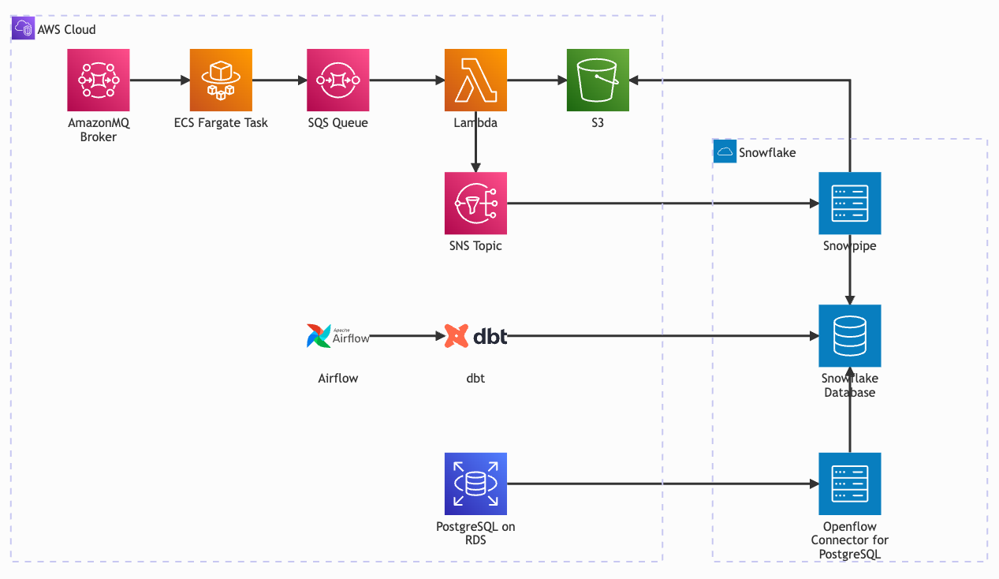

# Deliverables

## Architecture & Design

### Overview

The following section describes the data pipeline architecture for ingesting events from RabbitMQ
 (AmazonMQ) into Snowflake for analytical workloads.

### Architecture Diagram

### Data Flow

#### Historical PostgreSQL Ingestion (PostgreSQL -> Snowflake)

1. **PostgreSQL (RDS)**: Holds historical event data
    - Holds a snapshot of historical data, used as a snapshot to backfill data to Snowflake

2. **Openflow Connector for PostgreSQL**: Connects Snowflake to PostgreSQL
    - Configured to connect to RDS in AWS account
    - In this case, used to import a static snapshot of data from PostgreSQL to Snowflake.
    - Can be disconnected after raw data is ingested to dbt source table.

#### Event Ingestion (AmazonMQ -> S3)

1. **AmazonMQ Broker**: Receives events from three sources:
    - `cards`: Card catalog entries
    - `orders`: Order events
    - `manufacturing`: Manufacturing batch events

1. **ECS Fargate Task**: Consumes messages from AmazonMQ
    - Run as a containerized consumer service
    - Sends ACK to AmazonMQ only after successful delivery to SQS

1. **SQS Queue**: Buffers messages for batch processing
    - Configured to batch messages (i.e. max 100 messages or 1 minute timeout)
    - Allows messages to queue to satisfy Snoflake ingest best practices, such as filesize
     requirements
    - Handles retries when messages fail to serialize to S3

1. **Lambda Function**: Processes batched messages
    - Transforms batched protobuf messages to single file, JSON, parquet, etc.
    - Writes to S3 in partitioned structure
    - Publishes notification to SNS topic after S3 file is successfully created

1. **S3 Bucket**: Stores raw event data
    - Partition by date information: `year/month/day/`
    - Format: Newline-delimited JSON (NDJSON) or Parquet

#### Loading to Snowflake (S3 -> Snowflake)

1. **SNS Topic**: Notifies Snowpipe of new files
    - Triggered by Lambda function successfully creating file in S3
    - Delivers S3 file location to Snowpipe

1. **Snowpipe**: Auto-ingests data from S3
    - Triggered by internal SQS queue that receives messages from SNS topic.
    - Loads data into raw tables for dbt

#### Data Transformation (dbt)

1. **Airflow**: Orchestrates dbt transformations
    - Schedules dbt workflows on a cadence
    - Sends email when task in DAG fails

1. **dbt Models**: Transforms raw data to data catalog/marts
    - **Staging**: Gathers data from backfill and stream datasets, standardizes columns.
    - **Intermediate**: Combines staging data into single view for ease of use in data mart models.
    - **Marts**: Business-ready dimensional models
        - `dim_card`: Card dimension table
        - `fct_orders`: Order facts table
        - `fct_batch_performance`: Manufacturing batch performance facts table

## Data Modeling & Pipelines

- `./dbt`: Contains models and config for a dbt workflow to build the data marts using event
 backfill and stream data sources.
- `./airflow`: Contains a simple DAG that uses BashOperator tasks to call dbt, set to run every
 hour.

## Snowflake Design

### Snowflake DDL

`./snowflake`: Contains DDL for creating the database, warehouse, schema, and tables to get started
 with the dbt workflow. Also contains a few example queries using the data marts.

### Loading strategy from AWS

There are two parallel loading strategies to get data from AWS to Snowflake. The first loads the
 PostgreSQL table via Snowflake's Openflow Connector for PostgreSQL. Using this connector, we can
 connect Snowflake to the database to capture the entire dataset as a snapshot. Once this is in the
 `raw.events_backfill` table, dbt can use it to create views and use the data further in the
 pipeline. The second strategy involves loading serialied event data from the AmazonMQ to S3
 pipeline by automating Snowpipe using cloud messaging. When our pipeline puts a file into S3, it
 will fire an SNS notification. The Snowpipe subscribes to this SNS topic and fetchs/loads the data
 from that specific file automatically.

## Assumptions

- Data coming through is unique, and delivered only once.
- Backfill table's columns:
  - source: describes the upstream service that created the vent, something like `cards`, `orders`,
   `manufacturing`.
  - type: describes the event type emitted by the upstream service, corresponds to the protobuf
   class, i.e. `OrderCreated`, `CardCatalogCreated`, `ManufacturingBatch`.

## Tradeoffs

- For simplicities sake, I am using a single lambda function to ingest data from AmazonMQ. This aids
 the design by only have a single ingest point from AWS to Snowflake. I thought that for this
 exercise simple was better.
 This forces me to separate events into tables using dbt and filtering against the event source and
 type.
 I thought of using multiple handlers for each event type. This would have allowed me to scale each
 pipeline as I assume there are more order created events than card created events. But this does
 complicate the system by needing to maintain and monitor many lambda functions and snowpipes.
- For readability of files in S3, I could use compressed NDJSON files. This serializes the data into
 json strings delimited by new lines. This would use more storage. Alternatively, I could serialize
 to parquet files to further compress the data and save on storage costs.

## Future Enhancements

- The PostgreSQL database is purely used as a backfill to get historical data into Snowflake, I'm
 assuming it does not need to be maintained once the backfill is complete. If both have to be
 maintained, I would alter the architecture to put data to the PostgreSQL database first, then have
 the Openflow Connector for PostgreSQL capture new data from the database and load to Snowflake.
- Handle AmazonMQ's at-least-once delivery. This would involve the dbt pipeline handling
 de-duplication by canonacalizing the payload of the message by ordering stable fields and hashing
 the string. Then the dbt pipeline can use this hash as a unique key to de-duplicate the tables.
- Leverage dbt's incremental materialization to reduce computational load when creating the tables.
 This would decrease runtime of the pipeline by forcing dbt to only work with new data since the
 last run.
- Use a CI/CD pipeline on the dbt project to build a docker image with all files needed to run in
 Airflow. Then update the Airflow DAG to use a Docker operator to run the dbt command using a
 specific image stored in ECR. This would decouple the Airflow deployment from the dbt application.
- Implement more rigorous test suites. Instead of simple data tests, one off tests could be written
 to verify business logic in the underlying data. For example, a test could be created to verify
 that the number of cards sold does not exceed the number of cards produced (combining data from
 the `fct_orders` and `fct_batch_performance` tables). This test could trigger an alert to notify
 the team that a specific card was somehow oversold.
